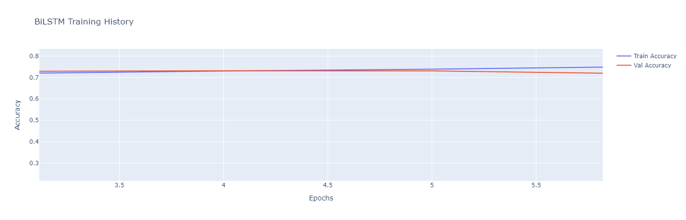
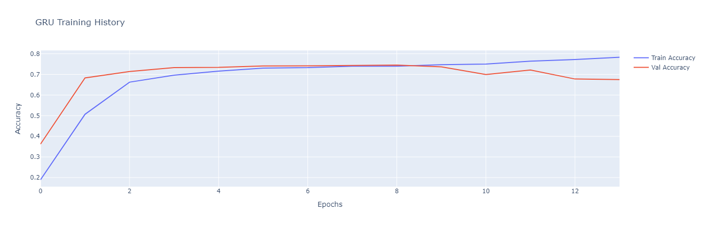
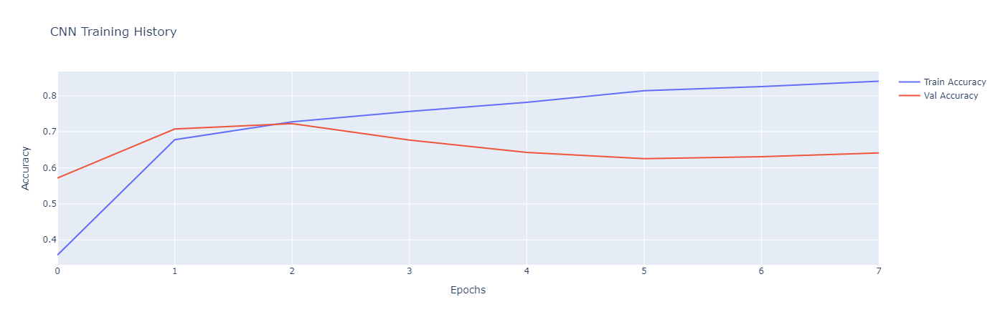

📊 Coleridge Initiative NLP Classification Project
Welcome to the Coleridge Initiative NLP Project!
This repository presents deep learning models (BiLSTM, GRU, CNN) developed to classify cleaned text labels extracted from research publications and datasets.
The goal is to build a robust text classification pipeline capable of handling short, domain-specific text entries using modern NLP techniques.

🗂️ Project Structure
📁 Coleridge Initiative Project/
├── datasets/
│   └── cleaned_train.csv
│   └── train.csv
├── images
├── coleridge_initiative_model.ipynb  ← Model training & evaluation
├── dataset_analysis.ipynb            ← EDA & insights
├── requirements.txt
│──.venv/                             ← Virtual environment
└── README.md

📌 Objectives
- 🧼 Clean and preprocess publication and dataset title text

- 🔠 Tokenize and pad sequences using Keras

- 🧠 Build and compare 3 deep learning architectures:

    - 🧬 BiLSTM
    - 🔁 GRU
    - 📶 CNN

- 📈 Visualize training progress and confusion matrices

- ⚖️ Address class imbalance using SMOTE

| Category          | Tools / Libraries                      |
| ----------------- | -------------------------------------- |
| **Language**      | Python 3.11                            |
| **DL Framework**  | TensorFlow / Keras                     |
| **ML Tools**      | Scikit-learn, SMOTE (Imbalanced-learn) |
| **Visualization** | Plotly                                 |
| **Notebook**      | Jupyter Notebook                       |

🔄 Data Pipeline
1- 🔗 Merge pub_title + dataset_title

2- 🔡 Tokenize & Pad using Keras Tokenizer

3- 🎯 Encode cleaned_label with LabelEncoder + One-Hot

4- 🔁 Stratified Train/Test Split

5- 📈 Balance Classes with SMOTE

6- 🧠 Train BiLSTM, GRU, and CNN

7- 🧪 Evaluate via classification report + confusion matrix

🧠 Model Architectures
🧬 BiLSTM
- Embedding → Bidirectional LSTM → Global Max Pool → Dense

- Handles long-range dependencies in text

🔁 GRU
- Embedding → GRU Layer → Global Max Pool → Dense

- Faster and simpler than LSTM with competitive results

📶 CNN
- Embedding → 1D Convolution → Max Pooling → Flatten → Dense

- Excels at capturing local features in text (like n-grams)

📊 Visualizations
🎯 Training Accuracy





🚀 Getting Started
1. Clone the repo

```bash
git clone https://github.com/habdelhadi08/NLP-ModelComparison.git
cd Coleridge Initiative Project
```
2. Set up environment

```bash
python -m venv .venv
source .venv/bin/activate  # or .venv\Scripts\activate on Windows
pip install -r requirements.txt
```

3. Run notebook
Launch the Jupyter Notebook:

```bash
jupyter notebook dataset_analysis.ipynb
jupyter notebook coleridge_initiative_model.ipynb
```

✅ Results Summary
| Model  | Accuracy (Val) | Strengths                                                     |
| ------ | -------------- | ------------------------------------------------------------- |
| BiLSTM | \~73%          | Best performance on sequence data; captures long dependencies |
| GRU    | \~74%          | Fewer parameters, faster training, good generalization        |
| CNN    | \~72%          | Captures local word patterns effectively with fast training   |

🛠 Limitations
- The dataset remains challenging due to its imbalance and short text length.
- Models tend to confuse semantically similar labels.
- Validation accuracy capped around 68–74% despite hyperparameter tuning.

🏁 Conclusion
This project highlights the effectiveness of neural network architectures—BiLSTM, GRU, and CNN—for classifying short text sequences.
Despite the inherent challenges of working with limited context and class imbalance, the models achieved validation accuracies ranging from 72% to 74%.

GRU emerged as a strong performer, offering competitive accuracy with efficient training time.
Future improvements may include exploring transformer-based models or integrating pre-trained embeddings (like GloVe or BERT).

This work demonstrates how deep learning techniques can support accurate classification of concise text data, enabling smarter indexing and retrieval in textual applications.

📬 Contact
Data Scientist: Heba Abdelhadi
📧 habdelhadi08@gmail.com
📍 Shelby Township, MI
📅 Capstone Project for Qwasar Data Science & Machine Learning Bootcamp